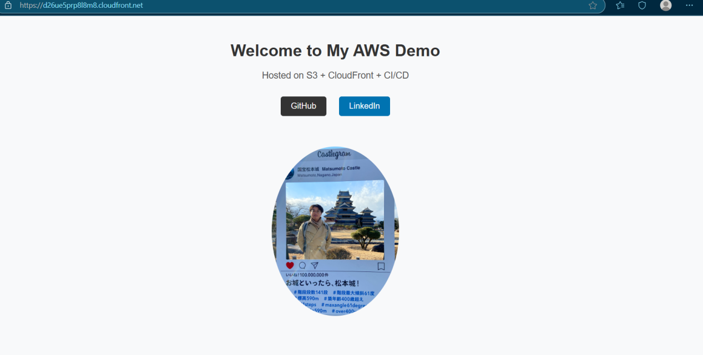
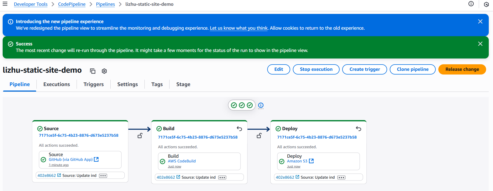
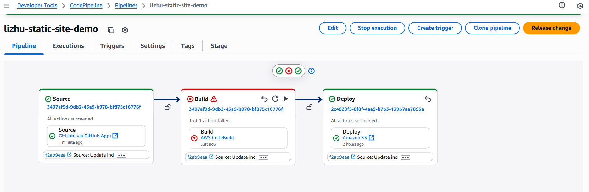
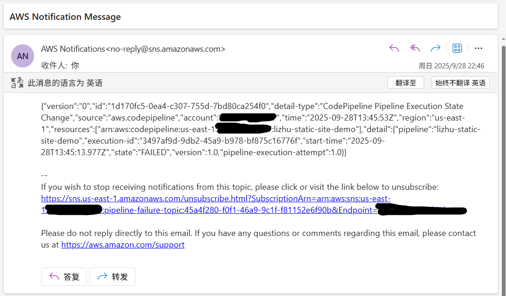

# AWS Static Site CI/CD

A fully automated GitHub → AWS CI/CD pipeline for hosting a static site with CloudFront Functions, S3 Versioning, and Least Privilege IAM policies. This project demonstrates building and deploying a static website with real-time alerts and secure deployment.

## 🛠 Key Features

GitHub → AWS CI/CD Integration — Fully automated static site deployment pipeline.

CloudFront Functions — Path rewriting, simple access control, and caching optimization.

S3 Versioning — Automatic version tracking for static assets.

IAM Least Privilege — Fine-grained IAM policies to secure the CI/CD pipeline.

CodeBuild Integration — Executes build commands to sync website files.

CloudWatch + SNS Alerts — Proactive failure notifications for deployments.

---

## 🔐 IAM Roles & Least Privilege Principle

This project applies least privilege IAM policies to ensure secure CI/CD operations.

- **CodeBuild Role**
  - **Permissions:**
    - Read/Write artifacts in pipeline S3 bucket (no delete).
    - Full sync (Get/Put/Delete/List) on deploy S3 bucket.
    - Write logs to CloudWatch.
    - Create build reports.
  - **Purpose:** Ensures CodeBuild can update the deployed site but cannot accidentally delete intermediate pipeline artifacts.  

- **CodePipeline Role**
  - **Permissions:**
    - Access artifacts in pipeline bucket.
    - Use GitHub connection via CodeStar Connections.
    - Start CodeBuild projects.
    - Deploy artifacts to the target S3 bucket.
  - **Purpose:** CI/CD orchestrator with just enough access to fetch, build, and deploy.  

---

## ✨ Additional Enhancements

- **CloudFront Functions**  
  Path rewrite, simple access control, and cache optimization.  

- **S3 Versioning**  
  Automatic version tracking for static site assets.  

- **CloudWatch + SNS**  
  Real-time failure alerting.  

---

## 💡 Coordination with S3 Bucket Policy

While the deploy bucket’s policy only allows public `GetObject` for website visitors, the CodeBuild IAM role has broader permissions (write, delete, list).  

This separation ensures **visitors can only read**, while **the pipeline can fully manage deployments**.

---

## 📊 Architecture Diagram

## 📸 Project Showcase

### Site UI

  
*Static site homepage hosted on S3 + CloudFront.*

### CI/CD Pipeline

  
*CodePipeline execution completed successfully.*

### Pipeline Failure Notification

  

*CloudWatch + SNS sending email on deployment failure.* 

⚠️ *All AWS resources were deleted after completion to avoid extra cost, so no live demo link is available.*  

---

### Quick Start

1. Download the repository as a ZIP file:  
   [Download Link](https://github.com/lizh1994/aws-static-site-cicd-lizhu/archive/refs/heads/main.zip)
2. Unzip the file to your local machine.
3. Navigate to `/src` to access the project source files (`index.html`, images, etc.).
4. Refer to `/docs` for detailed documentation.

*Detailed instructions are available in ![Deployment Alert]

---

## 🎯 Lessons Learned

1. IAM Permissions: Learned to balance least privilege with task feasibility. Many failures came from missing permissions, which pushed me to clarify the exact boundaries of each role.

2. Troubleshooting: Developed the habit of checking error logs first and fixing issues systematically instead of guessing.

3. Service Interactions: Realized the importance of mapping how services pass data. For example, forgetting build artifact output caused repeated deploy failures until I fixed the build stage.

### Key takeaway: Hands-on practice, combined with a problem-solving mindset, is the most effective way to learn AWS.
