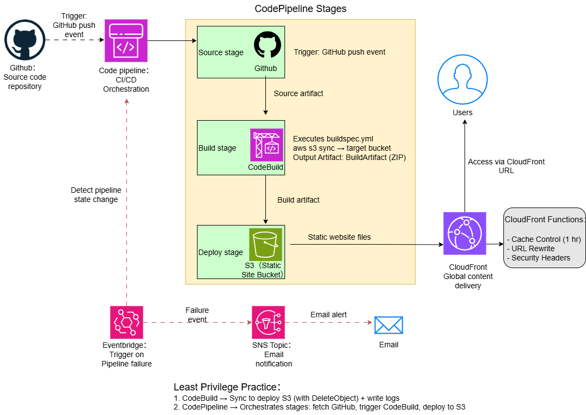
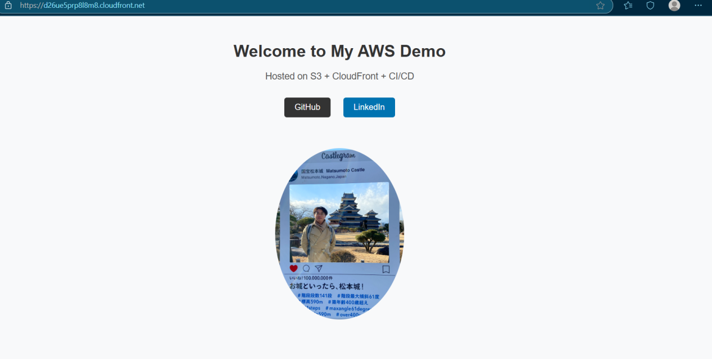

# AWS Static Site CI/CD

A fully automated GitHub → AWS CI/CD pipeline for hosting a static site with CloudFront Functions, S3 Versioning, and Least Privilege IAM policies. This project demonstrates building and deploying a static website with real-time alerts and secure deployment.

## 🛠 Key Features

GitHub → AWS CI/CD Integration — Fully automated static site deployment pipeline.

CloudFront Functions — Path rewriting, simple access control, and caching optimization.

S3 Versioning — Automatic version tracking for static assets.

IAM Least Privilege — Fine-grained IAM policies to secure the CI/CD pipeline.

CodeBuild Integration — Executes buildspec tasks to sync website files.

CloudWatch + SNS Alerts — Proactive failure notifications for deployments.

---

## 🔐 IAM Roles & Least Privilege Principle

This project applies least privilege IAM policies to ensure secure CI/CD operations.

- **CodeBuild Role**
  - **Permissions:**
    - Read/Write artifacts in pipeline S3 bucket (no delete).
    - Full sync (Get/Put/Delete/List) on deploy S3 bucket.
    - Write logs to CloudWatch.
    - Create build reports.
  - **Purpose:** Ensures CodeBuild can update the deployed site but cannot accidentally delete intermediate pipeline artifacts.  
  - **Summary:** `CodeBuild → Sync to deploy S3 (with DeleteObject) + write logs.`

- **CodePipeline Role**
  - **Permissions:**
    - Access artifacts in pipeline bucket.
    - Use GitHub connection via CodeStar Connections.
    - Start CodeBuild projects.
    - Deploy artifacts to the target S3 bucket.
  - **Purpose:** CI/CD orchestrator with just enough access to fetch, build, and deploy.  
  - **Summary:** `CodePipeline → Orchestrates stages: fetch GitHub, trigger CodeBuild, deploy to S3.`

---

## ✨ Additional Enhancements

- **CloudFront Functions**  
  Path rewrite, simple access control, and cache optimization.  

- **S3 Versioning**  
  Automatic version tracking for static site assets.  

- **CloudWatch + SNS**  
  Real-time failure alerting.  

---

## 📊 Architecture Diagram

## 📸 Project Showcase

  
*Static site homepage hosted on S3 + CloudFront.*

  
*CodePipeline execution completed successfully.*

  
*CloudWatch + SNS sending email on deployment failure.* 

⚠️ *All AWS resources were deleted after completion to avoid extra cost, so no live demo link is available.*  

---

## 🚀 Quick Start
